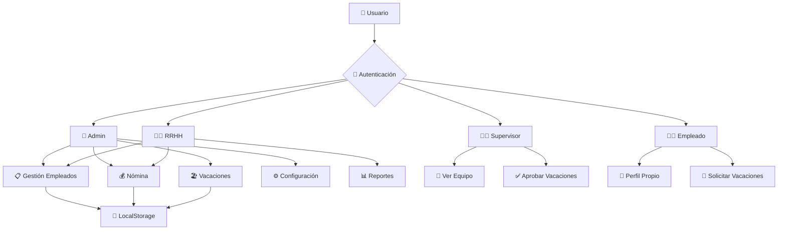

# 👥 Sistema de Gestión de Empleados
### **Prototipo Web Integral** | *Gestión, Nómina y Vacaciones*

<div align="center">

[](https://jenseyjim.github.io/Sistema-Gestion-Empleados/)
[](https://github.com/JenseyJim/Sistema-Gestion-Empleados)
[](#)

**🌐 [APLICACIÓN EN VIVO](https://jenseyjim.github.io/Sistema-Gestion-Empleados/)** 

*Gestión completa de recursos humanos con tecnologías web modernas*

</div>

---

## 🎯 **Visión del Proyecto**

> Un sistema integral de gestión de empleados que centraliza el registro de personal, automatiza cálculos de nómina con descuentos legales (AFP/ARS/ISR) y gestiona el flujo completo de solicitudes de vacaciones con aprobación por roles.

### ✨ **Características Destacadas**

🏢 **Gestión Integral de Empleados**
- Registro completo con datos personales y laborales
- CRUD completo con validaciones en tiempo real
- Búsqueda y filtrado inteligente

💰 **Sistema de Nómina Automatizado**
- Cálculo automático de descuentos legales
- Bonificaciones configurables
- Reportes detallados por empleado

🏖️ **Gestión de Vacaciones**
- Solicitud con validación de fechas
- Flujo de aprobación por supervisores
- Historial y bitácora completa

👤 **Control de Acceso por Roles**
- Autenticación simulada multi-rol
- Permisos diferenciados por función
- Vistas contextuales por usuario

💾 **Persistencia Local**
- Almacenamiento en LocalStorage
- Sin dependencias de backend
- Datos persistentes entre sesiones

---

## 🛠️ **Stack Tecnológico**

<table align="center">
<tr>
<td align="center">

<br><strong>Estructura</strong>
</td>
<td align="center">

<br><strong>Estilos</strong>
</td>
<td align="center">

<br><strong>Framework UI</strong>
</td>
<td align="center">

<br><strong>Lógica</strong>
</td>
</tr>
</table>

<div align="center">

**🚀 Desplegado en GitHub Pages** | **📱 Responsive Design** | **⚡ Vanilla JavaScript**

</div>

---

## 🏗️ **Arquitectura del Sistema**



### 📁 **Estructura del Proyecto**

```
🏢 Sistema-Gestion-Empleados/
├── 🏠 index.html          # SPA principal con todos los módulos
├── 🎨 styles.css          # Estilos personalizados + Bootstrap
└── ⚡ script.js           # Lógica de negocio y gestión UI
```

> **Arquitectura Simplificada:** 3 archivos para facilitar revisión académica y despliegue directo

---

## 🚀 **Guía de Instalación**

### **Opción 1: Acceso Directo** ⚡
```bash
# Clonar repositorio
git clone https://github.com/JenseyJim/Sistema-Gestion-Empleados.git

# Abrir en navegador
open index.html  # macOS
start index.html # Windows
```

### **Opción 2: Servidor Local** 🌐 *(Recomendado)*
```bash
# Con VS Code + Live Server
1. Abrir carpeta en VS Code
2. Instalar extensión "Live Server"
3. Clic derecho en index.html → "Open with Live Server"

# Con Python
python -m http.server 8000

# Con Node.js
npx http-server . -p 8080
```

---

## 📊 **Modelos de Datos**

### 👤 **Empleado**
```javascript
{
  id: "uuid-generado",
  nombre: "String",
  cedula: "000-0000000-0",
  fechaNacimiento: "YYYY-MM-DD",
  telefono: "String",
  correo: "email@dominio.com",
  direccion: "String",
  sueldoBase: Number,
  puesto: "String",
  departamento: "String",
  profesion: "String", 
  fechaIngreso: "YYYY-MM-DD",
  estado: "Activo|Inactivo"
}
```

### 💰 **Nómina**
```javascript
{
  empleadoId: "uuid",
  sueldoBase: Number,
  afp: Number,        // 2.87%
  ars: Number,        // 3.04% 
  isr: Number,        // 10% (simplificado)
  bonificaciones: Number,
  sueldoNeto: Number  // Base - Descuentos + Bonos
}
```

### 🏖️ **Vacaciones**
```javascript
{
  id: "uuid-generado",
  empleadoId: "uuid",
  fechaInicio: "YYYY-MM-DD",
  fechaFin: "YYYY-MM-DD", 
  motivo: "String",
  estado: "Pendiente|Aprobado|Rechazado",
  observaciones: "String opcional"
}
```

---

## 🔐 **Sistema de Roles y Permisos**

<table align="center">
<tr>
<th>👤 Rol</th>
<th>👥 Empleados</th>
<th>💰 Nómina</th>
<th>🏖️ Vacaciones</th>
<th>⚙️ Admin</th>
</tr>
<tr>
<td><strong>👑 Administrador</strong></td>
<td>✅ CRUD Completo</td>
<td>✅ Ver Todas</td>
<td>✅ Ver Todas</td>
<td>✅ Configuración</td>
</tr>
<tr>
<td><strong>👩‍💼 RRHH</strong></td>
<td>✅ CRUD Completo</td>
<td>✅ Cálculo/Resumen</td>
<td>✅ Ver Historial</td>
<td>❌ —</td>
</tr>
<tr>
<td><strong>👨‍💻 Supervisor</strong></td>
<td>👀 Ver su Equipo</td>
<td>❌ —</td>
<td>✅ Aprobar/Rechazar</td>
<td>❌ —</td>
</tr>
<tr>
<td><strong>👨‍🔧 Empleado</strong></td>
<td>👀 Ver Propio</td>
<td>👀 Ver Propio</td>
<td>📝 Solicitar/Ver Estado</td>
<td>❌ —</td>
</tr>
</table>

---

## 💼 **Historias de Usuario**

<details>
<summary><strong>📋 HU-001: Registro Completo de Empleados</strong></summary>

**Como** administrador de RRHH  
**Quiero** registrar datos personales y laborales completos  
**Para** gestionar eficientemente la información del personal

**✅ Criterios de Aceptación:**
- Formulario con validaciones en tiempo real
- Campos obligatorios y formatos específicos
- CRUD completo con actualización inmediata
- Persistencia en LocalStorage
- Feedback visual con toasts/alerts

</details>

<details>
<summary><strong>💰 HU-002: Cálculo Automático de Nómina</strong></summary>

**Como** encargado de nómina  
**Quiero** calcular automáticamente descuentos y bonificaciones  
**Para** generar pagos precisos y transparentes

**✅ Criterios de Aceptación:**
- Fórmulas automáticas para AFP/ARS/ISR
- Bonificaciones configurables
- Tabla resumen detallada
- Opción de exportación/impresión

</details>

<details>
<summary><strong>🏖️ HU-003: Gestión de Solicitudes de Vacaciones</strong></summary>

**Como** empleado  
**Quiero** solicitar vacaciones con validación automática  
**Para** gestionar mis períodos de descanso

**✅ Criterios de Aceptación:**
- Formulario con validación de fechas
- Estados: Pendiente/Aprobado/Rechazado
- Panel de aprobación para supervisores
- Historial completo de solicitudes

</details>

<details>
<summary><strong>🔐 HU-004: Control de Acceso por Roles</strong></summary>

**Como** usuario del sistema  
**Quiero** acceder solo a funciones autorizadas  
**Para** mantener la seguridad y confidencialidad

**✅ Criterios de Aceptación:**
- Login simulado con roles diferenciados
- Vistas contextuales por rol
- Ocultamiento/habilitación de funciones
- Sesión persistente

</details>

---

## 🧮 **Sistema de Nómina**

### 📊 **Cálculos Implementados**

| Concepto | Porcentaje | Base de Cálculo |
|----------|------------|------------------|
| **AFP** | 2.87% | Sueldo Base |
| **ARS** | 3.04% | Sueldo Base |
| **ISR** | 10% | Sueldo Base *(Simplificado)* |

### 💡 **Fórmula Final**
```javascript
Sueldo Neto = Sueldo Base - (AFP + ARS + ISR) + Bonificaciones
```

> **⚠️ Nota Académica:** Los porcentajes son educativos y no constituyen asesoría fiscal

---

## 🎨 **Interfaz y Experiencia**

### 📱 **Diseño Responsivo**
- **Mobile First:** Optimizado para dispositivos móviles
- **Bootstrap 5:** Framework moderno para UI consistente
- **Componentes Modulares:** Cards, modals y forms reutilizables

### 🎯 **UX Features**
- **Validación en Tiempo Real:** Feedback inmediato
- **Notificaciones Toast:** Confirmaciones y errores
- **Navegación Intuitiva:** Menús contextuales por rol
- **Búsqueda Dinámica:** Filtros en tiempo real

---

## 📈 **Roadmap y Próximos Pasos**

### 🚀 **Versión 2.0**
- [ ] **📄 Exportaciones Avanzadas** - PDF/Excel con formato profesional
- [ ] **📊 Dashboard Analytics** - Gráficos y métricas de RRHH
- [ ] **🔍 Auditoría Completa** - Log de cambios por usuario
- [ ] **🌐 API REST** - Backend con base de datos real

### 🧪 **Mejoras Técnicas**
- [ ] **🧪 Testing Suite** - Jest para pruebas unitarias
- [ ] **🎭 E2E Testing** - Playwright para pruebas de integración
- [ ] **🔧 Build Process** - Webpack/Vite para optimización
- [ ] **🔒 Seguridad Real** - JWT y encriptación

---

## 🤝 **Guía de Contribución**

### 🔄 **Proceso de Desarrollo**

1. **🍴 Fork del repositorio**
2. **🌿 Crear rama feature**
   ```bash
   git checkout -b feature/nueva-funcionalidad
   ```
3. **💻 Desarrollar con estándares**
   - JavaScript modular y documentado
   - Validación en múltiples navegadores
   - Responsive design
4. **📤 Pull Request**
   - Descripción detallada
   - Capturas de pantalla
   - Checklist de pruebas

### ✅ **Checklist de Contribución**
- [ ] ✅ Código sigue convenciones del proyecto
- [ ] 📱 Probado en mobile y desktop
- [ ] 🧪 Funcionalidades validadas
- [ ] 📝 Documentación actualizada
- [ ] 🎨 UI consistente con el diseño

---

## 👥 **Equipo de Desarrollo**

<div align="center">

### **🎓 Grupo 3 - Introducción a la Ingeniería de Software**

</div>

<table align="center">
<tr>
<td align="center">
<strong>🎖️ Team Lead</strong><br>
<strong>Jensey Jiménez</strong><br>
<code>2023-1800</code>
</td>
<td align="center">
<strong>🎨 Frontend Dev</strong><br>
<strong>Mario Soriano</strong><br>
<code>2023-0998</code>
</td>
<td align="center">
<strong>⚙️ Backend Dev</strong><br>
<strong>Gredd Rodriguez</strong><br>
<code>2023-0994</code>
</td>
</tr>
<tr>
<td align="center">
<strong>🎯 UX/UI Designer</strong><br>
<strong>Joan Gomez</strong><br>
<code>2022-0072</code>
</td>
<td align="center">
<strong>📊 Data Analyst</strong><br>
<strong>Juan Carlos Díaz</strong><br>
<code>2022-1946</code>
</td>
<td align="center">
<strong>🧪 QA Tester</strong><br>
<strong>Patryck Jimenez</strong><br>
<code>2023-1953</code>
</td>
</tr>
<tr>
<td align="center" colspan="3">
<strong>🔧 DevOps Engineer</strong><br>
<strong>Eric Alberto Jimenez</strong><br>
<code>2023-0966</code>
</td>
</tr>
</table>

<div align="center">

**👩‍🏫 Docente:** Prof. Evanyeline Brito Rojas  
**📚 Asignatura:** Introducción a la Ingeniería de Software

</div>

---

## 📜 **Información Académica**

Este proyecto es un **prototipo académico** diseñado para demostrar:

✅ **Flujos completos de RRHH** con tecnologías web  
✅ **Arquitectura SPA** sin dependencias complejas  
✅ **Gestión de estado** con LocalStorage  
✅ **UI/UX modernas** con Bootstrap y JavaScript vanilla  

> **⚠️ Importante:** Para uso en producción se requiere backend real, base de datos segura y validaciones fiscales oficiales.

---

<div align="center">

**🏢 Desarrollado con ❤️ por el Grupo 3**

[](https://jenseyjim.github.io/Sistema-Gestion-Empleados/)
[](https://github.com/JenseyJim/Sistema-Gestion-Empleados)

*"Simplificando la gestión de recursos humanos, una línea de código a la vez"* ✨

**© 2025 Sistema de Gestión de Empleados** - Proyecto Académico

</div>
